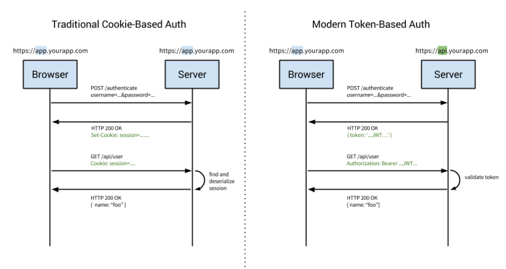

# Authentication and Authorization

**Authentication = login + password (who you are)**

**Authorization = permissions (what you are allowed to do)**

## Authentication
Authentication is the practice of validating the identity of a registered user attempting to gain access to an application, API, microservices or any other data resource. 

## Authorization
In contrast, once you are authenticated, authorization is about deciding whether an individual is permitted to perform a given action on a specific resource.

Once you are authenticated to the website, then authorization policies kick in to determine what resources you can access.

There are now many different authentication processes that can be used that can be used to validate a user’s identity.

**Single Sign-On (SSO)** allows a user to leverage a single set of login credentials to access multiple applications. Think using your **Facebook or Google** log in to access several different applications. A technique called **federation** is used by SSO systems when the applications you are logging into are spread across different domains. Industry standards like **Security Assertion Markup Language (SAML)** and **OpenID Connect (OIDC)** facilitate this process.

Multi-Factor Authentication (MFA) requires multiple means of authentication. One example is logging into a website with your username and password but then you are asked to provide a one-time access code that the website sends to the user’s cell phone. The goal is to create multiple security layers to provide a higher level of assurance during the authentication step.

https://medium.com/@vivekmadurai/different-ways-to-authenticate-a-web-application-e8f3875c254a

## how to handle authentication on RESTful APIs.

* Cookie-Based authentication
* Token-Based authentication
* Third party access(OAuth, API-token)
* OpenId
* SAML

## * Cookie-Based authentication

